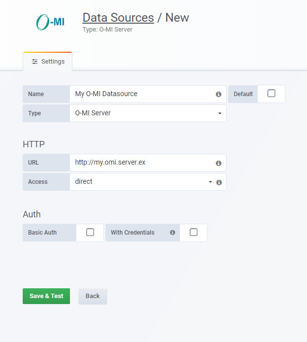
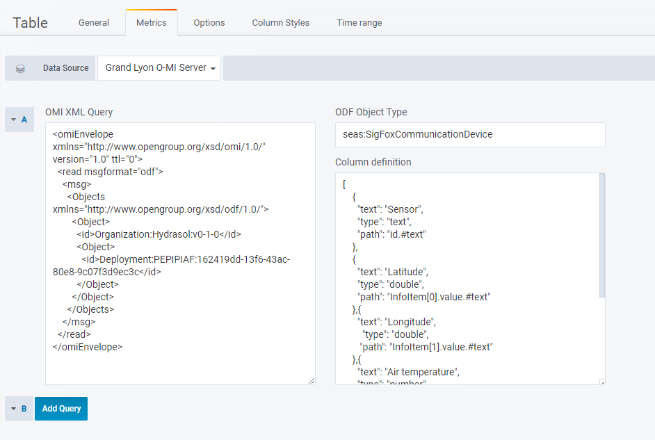

## O-MI Server Datasource

More documentation about datasource plugins can be found in the [Docs](https://github.com/grafana/grafana/blob/master/docs/sources/plugins/developing/datasources.md).

This datasource allows Grafana to connect to a O-MI node Server and retrieve data in O-DF to be shown on a [Table Panel](http://docs.grafana.org/features/panels/table_panel/).
This repository has been developed for the Euorpean Project [bIoTope](https://biotope-project.eu/).

## Installation

Since this is not an official plugin, it is not possible to install it using `grafana-cli`.

You can download or clone this repository and place it under the `data/plugins` directory of your Grafana installation. 

Navigate to the plugin directory and install all the dependencies:
```
npm install
```
To compile the datasource you can use the command:
```
npm run build
```
or navigate to the `node_modules/grunt` directory and issue the `grunt` command. You can now start your Grafana server instance
and see the **_O-MI Server_** plugin under the _**Plugin**_ section.

### Usage

Create a datasource using the O-MI Server plugin and pointing to your O-MI server:


Create a Table Panel and specify the Datasource you just created.

In order to create the query for the O-MI server, you need to specify 3 parameters: 
the XML query, the Object Type you want to collect and the table columns mapping based
on the elements retrieved.

##### XML query
Is the exact copy of the XML query that is generated using the local O-MI Server web
interface. It follows the [Communication Protocol Standards for O-MI](http://www.opengroup.org/iot/omi/p2.htm).

Here's an example of a XML query:
```
<omiEnvelope xmlns="http://www.opengroup.org/xsd/omi/1.0/" version="1.0" ttl="0">
  <read msgformat="odf">
    <msg>
      <Objects xmlns="http://www.opengroup.org/xsd/odf/1.0/">
        <Object>
          <id>OMI-Service</id>
          <Object>
            <id>Settings</id>
          </Object>
        </Object>
      </Objects>
    </msg>
  </read>
</omiEnvelope>
```
##### Object Type
In order for the datasource to generate a list of O-DF items, you have to provide a Object Type
to instruct the datasource to collect all the O-DF objects of such type from the response. 
So if you want all the Objects of type `fooBar` you can compile this field with the string `fooBar`.

##### Table columns structure
The O-MI server responds with an XML message. The Table Panel expects a specific JSON to populate the table.
Internally the datasource converts the O-DF objects list in a JSON array, in order to map the values for the table.

In this field you can specify three values for each column: the text to show as header, the type of the column and the path
in dot notation to the value in the O-DF element:
```
[
  [...other columns...]
  {
    "text": "Latitude",
    "type": "double",
    "path": "path.to.latitude.in.odf.object"
  }
  [...other columns...]
]
```
This allows the datasource to map the values to the table columns.
You can see [some examples in this repository](src/samples).

##### Example full metrics configuration


